# Clustering techniques in graphs and application to point cloud data

In the following we compared two techniques of **clustering** **Kmeans** and **spectral clustering**. For spectral clustering we implemented the **Normalized Spectral Clustering technique from Ng, Jordan, and Weiss** described in following reference:

> *A Tutorial on Spectral Clustering*, Ulrike von Luxburg, 2007

In **part I** we used a generative model of graphs called **mixed membership stochastic block model (MMSBM)** from reference:

> *Mixed Membership Stochastic Block models*, Edoardo M. Airoldi, David M. Blei, Stephen E. Fienberg, Eric P. Xing, 2008

We show how kmeans and spectral clustering performs in this framework

In **part II** we used the previous methods of graph clustering to perform **clustering on a point cloud data (PCD)**

Again we show how kmeans and spectral clustering performs in this framework

## Part I: mixed membership stochastic block model (MMSBM)

Here is a summarized presentation of the generative model:

  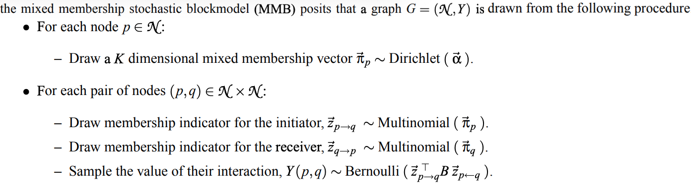

### low complexity graphs

- model:

We sampled MMSBM graphs with parameters:

  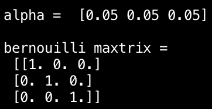

  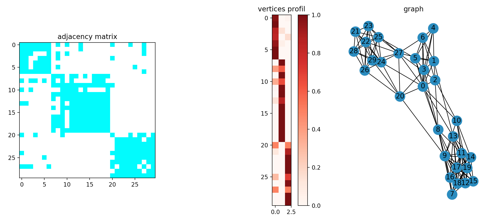

  

- Kmeans clustering using adjacency representation:

  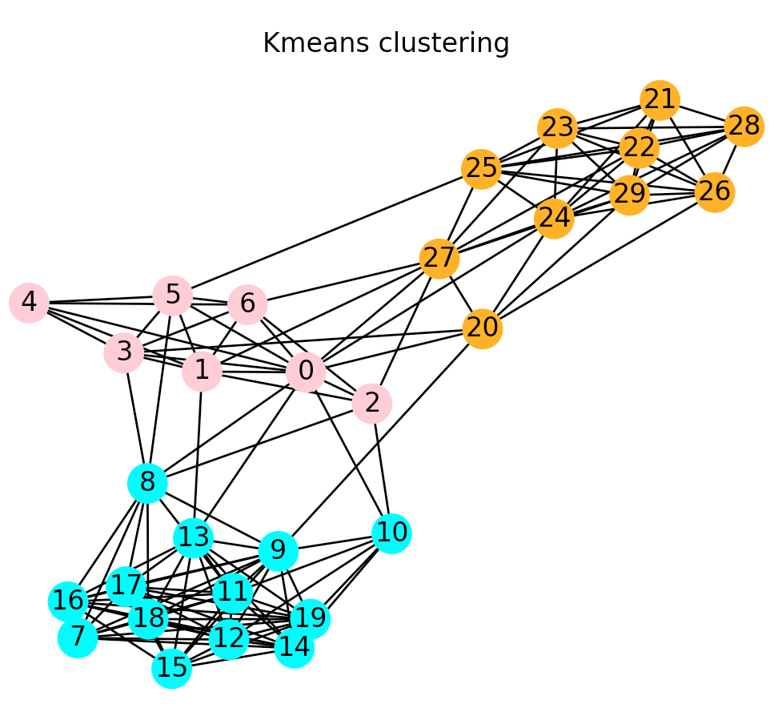

- Normalized Spectral Clustering:

  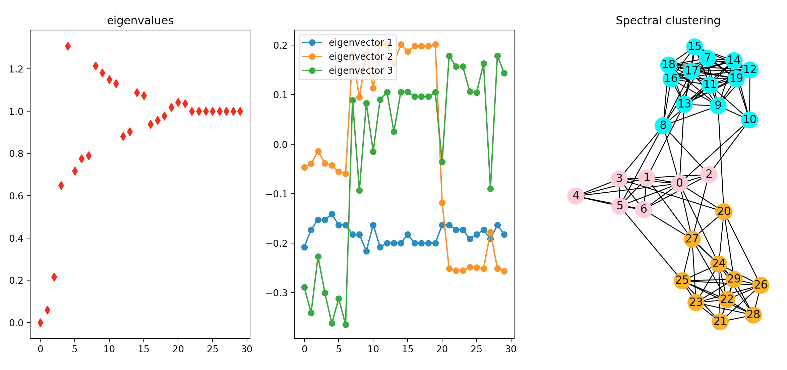

- Results:

  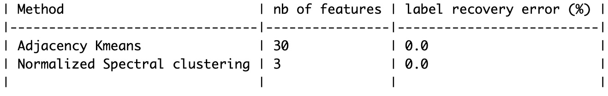

### medium complexity graphs

- model:

We sampled MMSBM graphs with parameters:

  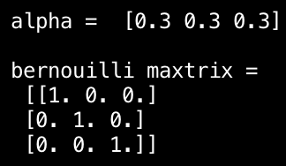

  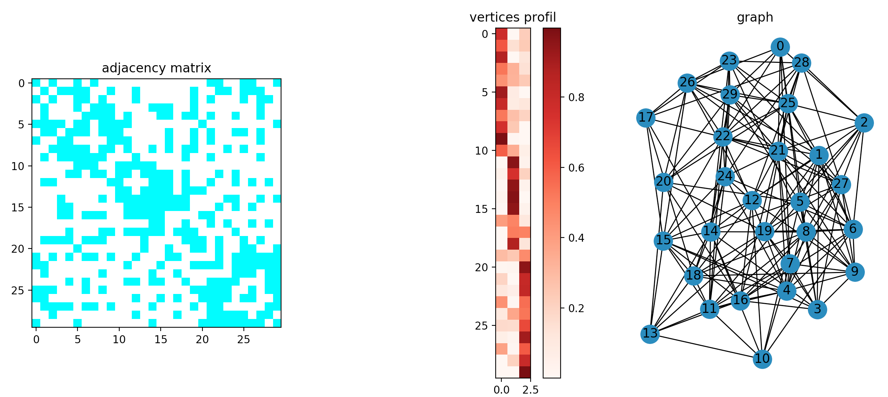

  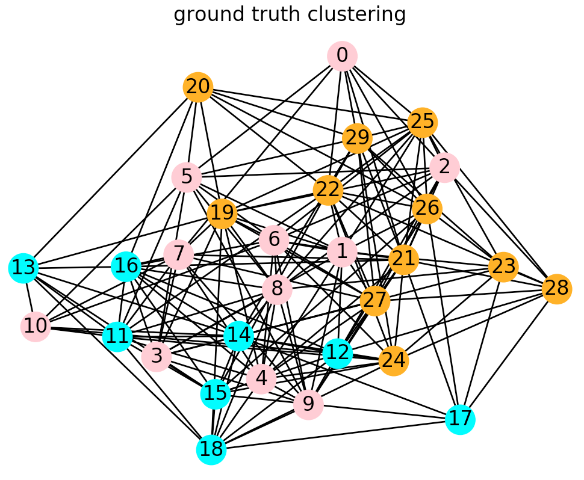

- Kmeans clustering using adjacency representation:

  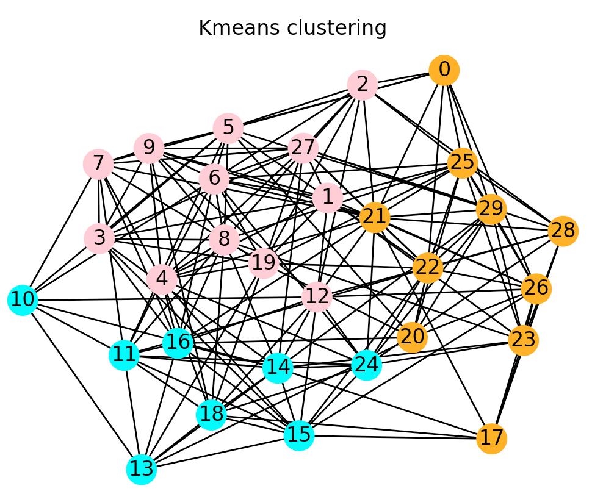

- Normalized Spectral Clustering:

  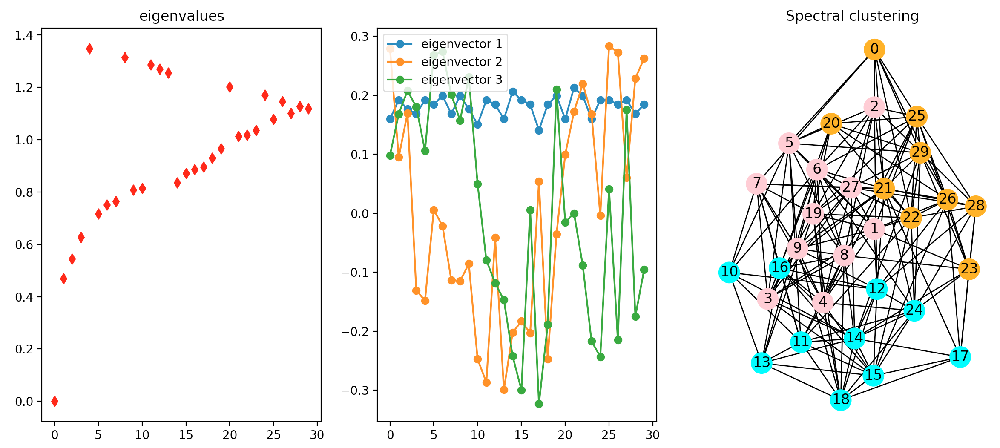

- Results:

  

### low complexity graphs high sparsity

- model:

We sampled MMSBM graphs with parameters:

  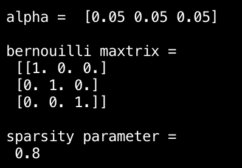

we sample each edge with (1-rho) x proba_matching

  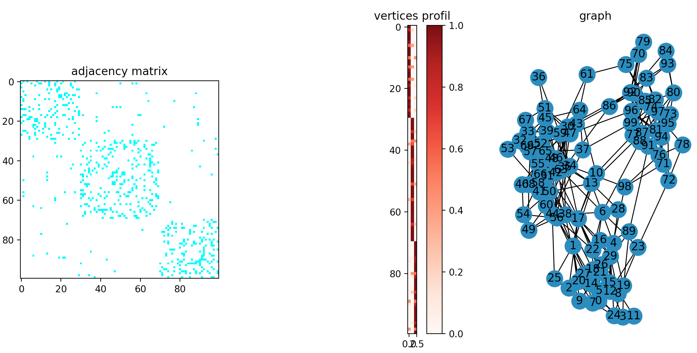

- Kmeans clustering using adjacency representation:

  

- Normalized Spectral Clustering:

  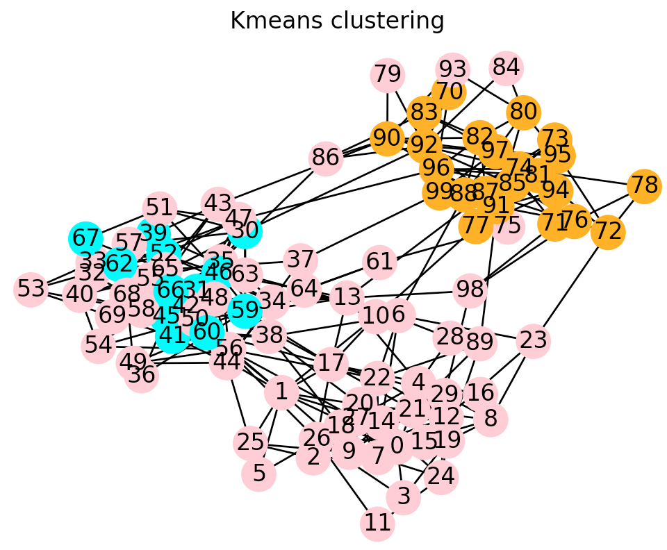

- Results:

  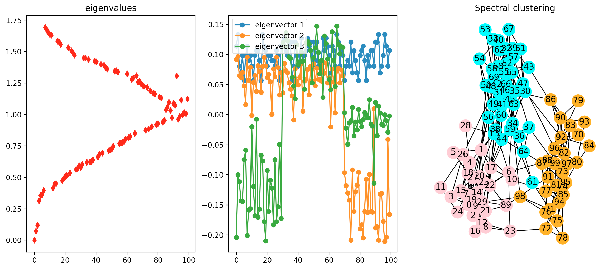

## Part II: Application to Point Cloud Data

