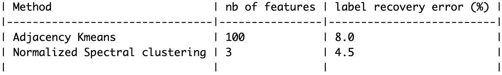
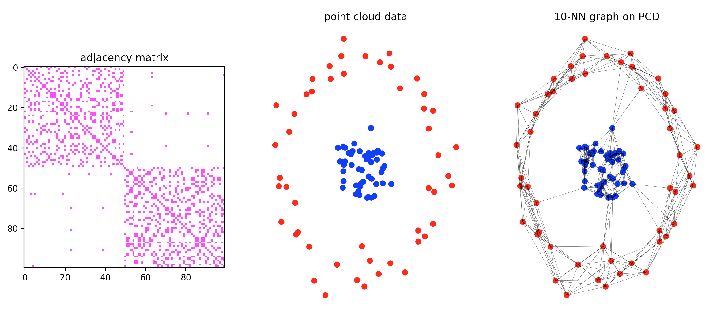
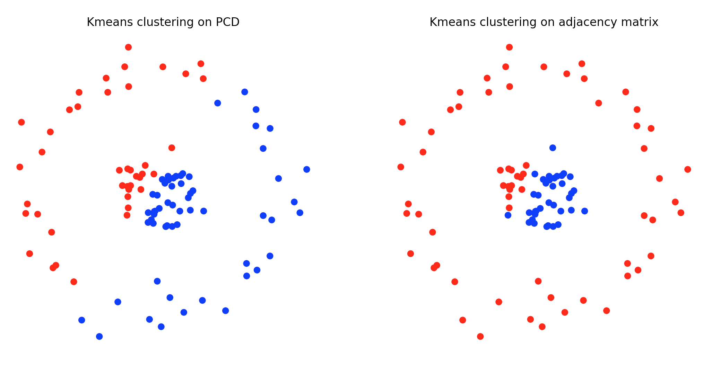
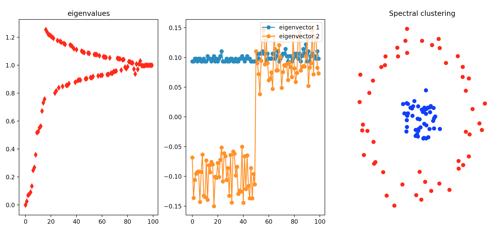
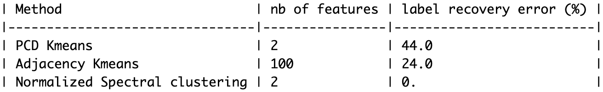

# Clustering techniques in graphs and application to point cloud data

In the following we compared two techniques of **clustering** **Kmeans** and **spectral clustering**. For spectral clustering we implemented the **Normalized Spectral Clustering technique from Ng, Jordan, and Weiss** described in following reference:

> *A Tutorial on Spectral Clustering*, Ulrike von Luxburg, 2007

In **part I** we used a generative model of graphs called **mixed membership stochastic block model (MMSBM)** from reference:

> *Mixed Membership Stochastic Block models*, Edoardo M. Airoldi, David M. Blei, Stephen E. Fienberg, Eric P. Xing, 2008

We show how kmeans and spectral clustering performs in this framework

In **part II** we used the previous methods of graph clustering to perform **clustering on a point cloud data (PCD)**

Again we show how kmeans and spectral clustering performs in this framework.

Graph complexity depends on the complexity of **vertices profils**. In order to compare performance we computed a **label recovery error**. Although it should be noted that here models only perform **partial recovery**. Indeed each model maps each vertex to one cluster while MMSBM model is much more complex is general. Indeed each vertex maps to a proportion of membership for each community. As a consequence we considered for each vertex the true cluster to be the cluster for which **the proportion of membership is the highest**.

## Part I: mixed membership stochastic block model (MMSBM)

Here is a summarized presentation of the generative model:

  

### Low complexity graphs

- model:

We sampled MMSBM graphs with parameters:

  

  

  

- Kmeans clustering using adjacency representation:

  

- Normalized Spectral Clustering:

  

- Results (averaged over 12 sampling):

  

### Medium complexity graphs

- model:

We sampled MMSBM graphs with parameters:

  

  

  

- Kmeans clustering using adjacency representation:

  

- Normalized Spectral Clustering:

  

- Results (averaged over 12 sampling):

  

### Low complexity graphs high sparsity

- model:

We sampled MMSBM graphs with parameters:

  

we sample each edge with (1-sparsity_param) x proba_edge

  

  

- Kmeans clustering using adjacency representation:

  

- Normalized Spectral Clustering:

  

- Results (averaged over 12 sampling):

  

### In Conclusion:

- With **low sparsity**, kmeans tends to perform slightly better. It is expected since Kmeans over adjancency matrix use a lot more dimensions than spectral clustering.

- With **high sparsity**, spectral clustering performs better than kmeans. It can be explained by the fact that if Kmeans use a lot more dimensions, it focuses on intra cluster information and gets easily stuck in **local minima**. In the contrary spectral clustering method focuses on inter-cluster information.
  Actually the latter graph looks like a **k-Nearest-Neighborhood graph**. In the next part we will see that we can use this property to perform clustering in point cloud data.

## Part II: Application to Point Cloud Data

- Point Cloud Data model and k-NN graphs. Graph is made symmetric by taking A_sym_ij = {np.max(A_ij, A_ji)}_ij

  

- Kmeans clustering using respectively PCD and adjacency representation:

  

- Normalized Spectral Clustering:

  

- Results (averaged over 10 sampling):

  

